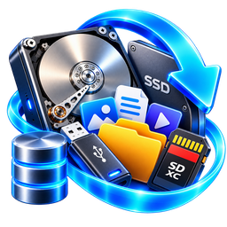

# برنامج استرجاع الملفات المحذوفة — Deleted Files Recovery Program

**استرجع ملفاتك المحذوفة من الأقراص الصلبة وأقراص SSD والفلاشات وبطاقات الذاكرة — على ويندوز**
 
**Recover deleted files from hard drives, SSDs, USB flash drives and memory cards — on Windows**

[العربية](#العربية) · [English](#english) · [سجل الإصدارات / Release history](#-سجل-الإصدارات--release-history)

---

## ⬇️ التنزيل — Download

| المنصة / Platform | الملف / File | الوصف | Description |
|---|---|---|---|
| 🪟 **Windows** | [**recovery-gui_0.4.31_x64-setup.exe**](https://github.com/ssmm6000/FileRecovery-Releases/releases/download/v0.4.31/recovery-gui_0.4.31_x64-setup.exe) | المثبّت العادي (موصى به) | Standard installer (recommended) |
| 🪟 **Windows** | [recovery-gui_0.4.31_x64_ar-SA.msi](https://github.com/ssmm6000/FileRecovery-Releases/releases/download/v0.4.31/recovery-gui_0.4.31_x64_ar-SA.msi) | حزمة MSI للتثبيت عبر سياسات المؤسسات | MSI package for managed/enterprise deployment |

---

## العربية

### ما هو برنامج استرجاع الملفات المحذوفة؟

**برنامج استرجاع الملفات المحذوفة** يعمل على ويندوز، ويبحث في القرص عن الملفات التي حُذفت أو ضاعت بعد فورمات أو تلف، ويستخرجها إلى مكان آمن. يعمل على الأقراص الصلبة وأقراص SSD والفلاشات وبطاقات الذاكرة وملفات صور الأقراص، **ولا يكتب أي شيء على القرص الذي تسترجع منه**.

### لماذا تستخدمها؟

- 🗑️ **حذفت ملفاً بالخطأ** أو أفرغت سلة المحذوفات: الفحص السريع يعيده باسمه ومجلده إن كان القسم سليماً.
- 💽 **فورمات أو قسم مفقود:** الفحص العميق يستخرج الملفات من محتواها مباشرة، والبحث عن الأقسام يجد الأقسام المحذوفة.
- ⚠️ **فلاش أو قرص تالف:** يتجاوز القطاعات التالفة ويكمل، ومعه وضع سريع يتخطى المناطق الميتة بدل التعلّق بها لساعات.
- 🧩 **ملفات ناقصة:** يحاول إصلاح الملفات الجزئية تلقائياً عند الاسترجاع، ويحفظ الأصل بجانبها.

### المزايا

| الميزة | |
|---|:---:|
| فحص سريع لأنظمة NTFS و FAT32 و exFAT و ext4 و HFS+ (يكتشف أقسام القرص تلقائياً) | ✅ |
| فحص عميق بالتوقيع يتعرف على مئات صيغ الملفات (صور، فيديو، صوت، Office، PDF، أرشيفات، قواعد بيانات، صور RAW…) | ✅ |
| وضع "تخطّي المناطق التالفة والبطيئة" مع إعادة المحاولة عليها لاحقاً | ✅ |
| استئناف الفحص العميق من حيث توقف، وفحص متوازٍ بعدة خيوط | ✅ |
| البحث عن الأقسام المحذوفة واسترجاعها | ✅ |
| نسخ القرص إلى ملف صورة (Image) مع تجاوز القطاعات التالفة | ✅ |
| إصلاح الملفات الجزئية تلقائياً (صور، Office، PDF، أرشيفات، صوت وفيديو) | ✅ |
| معاينة الصور قبل الاسترجاع، وعرض Hex لأي ملف | ✅ |
| استرجاع جماعي مع التحقق من أن الوجهة على قرص مختلف عن المصدر | ✅ |
| تقارير بصيغ PDF و CSV و JSON مع بصمة SHA-256 لكل ملف مسترجع | ✅ |
| محرر أقسام ونقل الأقسام (قرص النظام محمي) | ✅ |
| حالة القرص S.M.A.R.T. (الصحة والحرارة وساعات التشغيل) | ✅ |
| التحديث من داخل البرنامج مع التحقق من سلامة الملف | ✅ |
| العربية والإنجليزية، الوضع الفاتح والداكن | ✅ |

### 🔐 الأمان والخصوصية

- **القرص المصدر للقراءة فقط:** الفحص والاسترجاع لا يكتبان عليه أبداً؛ أدوات تعديل الأقسام منفصلة ولا تعمل إلا حين تطلبها بنفسك.
- **تحذير الوجهة:** يمنعك البرنامج من حفظ الملفات المسترجعة على القرص نفسه الذي تسترجع منه، حتى لا تُكتب فوق ملفات لم تُسترجع بعد.
- **صدق النتائج:** المناطق التي تعذّرت قراءتها تظهر في النتائج والتقرير على أنها "غير مقروءة"، ولا تُعرض كأنها بيانات حقيقية.
- **لا يرسل أي بيانات:** البرنامج يتصل بالإنترنت فقط ليقرأ رقم آخر إصدار من هذه الصفحة.

### متطلبات التشغيل

- Windows 10 أو 11 (64-بت).
- صلاحيات المسؤول (يطلبها البرنامج تلقائياً عند فتحه، لأن قراءة الأقراص مباشرة تحتاجها).

### التثبيت

نزّل `recovery-gui_<الإصدار>_x64-setup.exe` وشغّله، ثم افتح البرنامج من قائمة ابدأ.

> - عند فتح البرنامج يظهر طلب ويندوز للسماح (UAC) — اضغط "نعم".
> - قد يظهر تحذير **Windows SmartScreen** لأن الملف غير موقّع رقمياً: اضغط "معلومات إضافية" ثم "تشغيل على أي حال".

> **نصيحة مهمة:** لا تثبّت البرنامج ولا تحفظ الملفات المسترجعة على القرص الذي تريد الاسترجاع منه. وإن كان القرص أو الفلاش تالفاً فتوقّف عن استخدامه، وابدأ بفحص عميق مع خيار "تخطّي المناطق التالفة والبطيئة".

### التحديث

- من داخل البرنامج اضغط زر **"التحديثات"**: يتحقق من آخر إصدار هنا، وينزّل المثبّت ويتحقق من سلامته (الحجم وبصمة SHA-256) قبل تشغيله.
- أو نزّل الإصدار الجديد من هذه الصفحة وثبّته فوق القديم.

---

## English

### What is the Deleted Files Recovery Program?

**Deleted Files Recovery Program** is a Windows program that searches a disk for files that were deleted or lost after a format or damage, and copies them out to a safe place. It works on hard drives, SSDs, USB flash drives, memory cards and disk image files, and **never writes anything to the disk you are recovering from**.

### Why use it?

- 🗑️ **Deleted a file by mistake** or emptied the Recycle Bin: a quick scan brings it back with its name and folder while the partition is intact.
- 💽 **Formatted or lost a partition:** the deep scan extracts files straight from their content, and the partition search finds deleted partitions.
- ⚠️ **Failing flash drive or disk:** bad sectors are skipped and the scan carries on, with a fast mode that jumps past dead regions instead of hanging on them for hours.
- 🧩 **Incomplete files:** partial files are repaired automatically on recovery, with the original kept beside them.

### Features

| Feature | |
|---|:---:|
| Quick scan for NTFS, FAT32, exFAT, ext4 and HFS+ (finds the disk's partitions automatically) | ✅ |
| Signature-based deep scan recognizing hundreds of file formats (photos, video, audio, Office, PDF, archives, databases, RAW…) | ✅ |
| "Skip damaged and slow regions" mode, with a later retry of the skipped regions | ✅ |
| Resumable deep scans and multi-threaded scanning | ✅ |
| Lost / deleted partition search and recovery | ✅ |
| Disk imaging to a file, working around bad sectors | ✅ |
| Automatic repair of partial files (images, Office, PDF, archives, audio & video) | ✅ |
| Image preview before recovery, and a Hex view of any file | ✅ |
| Bulk recovery, with a check that the destination is on a different disk | ✅ |
| PDF, CSV and JSON reports with a SHA-256 digest of every recovered file | ✅ |
| Partition editor and partition move (the system disk is protected) | ✅ |
| S.M.A.R.T. disk health (status, temperature, power-on hours) | ✅ |
| In-app updates with file integrity checks | ✅ |
| Arabic & English, light & dark mode | ✅ |

### 🔐 Safety & privacy

- **The source disk is read-only:** scanning and recovery never write to it; the partition tools are separate and only run when you ask for them.
- **Destination warning:** the program stops you from saving recovered files onto the same disk you are recovering from, so they can't overwrite files not yet recovered.
- **Honest results:** regions that could not be read are listed in the results and report as "unreadable", never shown as if they were real data.
- **No data leaves your PC:** the program only goes online to read the latest version number from this page.

### System requirements

- Windows 10 or 11 (64-bit).
- Administrator rights (requested automatically on launch, since reading disks directly requires them).

### Installation

Download `recovery-gui_<version>_x64-setup.exe`, run it, then open the program from the Start Menu.

> - Windows shows a permission prompt (UAC) when you open the program — click "Yes".
> - **Windows SmartScreen** may warn because the file isn't digitally signed: click "More info" → "Run anyway".

> **Important:** don't install the program or save recovered files on the disk you want to recover from. If the disk or flash drive is failing, stop using it and start with a deep scan with "Skip damaged and slow regions" turned on.

### Updating

- Inside the program press **"Updates"**: it checks the latest release here, downloads the installer and verifies it (size and SHA-256 digest) before running it.
- Or download the new version from this page and install it over the old one.

---

## 📜 سجل الإصدارات — Release history

| الإصدار / Version | التاريخ / Date | الجديد | What's new | التنزيل / Download |
|---|---|---|---|---|
| [**0.4.31**](https://github.com/ssmm6000/FileRecovery-Releases/releases/tag/v0.4.31)  الأحدث · latest | 2026-10-07 | إصلاح الملفات السليمة المزيّفة وأخطاء exFAT/FAT32 وتسريع الفحص السريع | Fix fake Good files, exFAT/FAT32 bugs, faster quick scan | [Setup](https://github.com/ssmm6000/FileRecovery-Releases/releases/download/v0.4.31/recovery-gui_0.4.31_x64-setup.exe) · [MSI](https://github.com/ssmm6000/FileRecovery-Releases/releases/download/v0.4.31/recovery-gui_0.4.31_x64_ar-SA.msi) |
| [0.4.30](https://github.com/ssmm6000/FileRecovery-Releases/releases/tag/v0.4.30) | 2026-10-06 | تسريع الفحص العميق ~20 ضعفاً وتقدّم مرئي | Deep scan ~20x faster, visible progress | [Setup](https://github.com/ssmm6000/FileRecovery-Releases/releases/download/v0.4.30/recovery-gui_0.4.30_x64-setup.exe) · [MSI](https://github.com/ssmm6000/FileRecovery-Releases/releases/download/v0.4.30/recovery-gui_0.4.30_x64_ar-SA.msi) |
| [0.4.29](https://github.com/ssmm6000/FileRecovery-Releases/releases/tag/v0.4.29) | 2026-10-05 | الاسترجاع الجماعي: زر واحد واضح لإيقاف الاسترجاع، وعدّاد تقدّم مقروء | Bulk recovery: one clear Stop button and a readable progress counter | [Setup](https://github.com/ssmm6000/FileRecovery-Releases/releases/download/v0.4.29/recovery-gui_0.4.29_x64-setup.exe) · [MSI](https://github.com/ssmm6000/FileRecovery-Releases/releases/download/v0.4.29/recovery-gui_0.4.29_x64_ar-SA.msi) |
| [0.4.28](https://github.com/ssmm6000/FileRecovery-Releases/releases/tag/v0.4.28) | 2026-10-05 | وضع "تخطّي المناطق التالفة والبطيئة" في الفحص العميق مع إعادة المحاولة عليها، وسجل تشخيص أدق، وواجهة تتكيّف مع حجم النافذة | Deep-scan "skip damaged and slow regions" mode with retry, richer diagnostics log, layout that adapts to the window size | [Setup](https://github.com/ssmm6000/FileRecovery-Releases/releases/download/v0.4.28/recovery-gui_0.4.28_x64-setup.exe) · [MSI](https://github.com/ssmm6000/FileRecovery-Releases/releases/download/v0.4.28/recovery-gui_0.4.28_x64_ar-SA.msi) |
| [0.4.27](https://github.com/ssmm6000/FileRecovery-Releases/releases/tag/v0.4.27) | 2026-10-04 | أيقونة جديدة، والفحص السريع يكتشف أقسام القرص الكامل تلقائياً | New icon; quick scan finds a whole disk's partitions automatically | [Setup](https://github.com/ssmm6000/FileRecovery-Releases/releases/download/v0.4.27/recovery-gui_0.4.27_x64-setup.exe) · [MSI](https://github.com/ssmm6000/FileRecovery-Releases/releases/download/v0.4.27/recovery-gui_0.4.27_x64_ar-SA.msi) |
| [0.4.24](https://github.com/ssmm6000/FileRecovery-Releases/releases/tag/v0.4.24) | 2026-10-04 | إصلاح الملفات الجزئية تلقائياً عند الاسترجاع، ونحو 70 صيغة جديدة في الفحص العميق | Automatic repair of partial files on recovery; about 70 new deep-scan formats | [Setup](https://github.com/ssmm6000/FileRecovery-Releases/releases/download/v0.4.24/recovery-gui_0.4.24_x64-setup.exe) · [MSI](https://github.com/ssmm6000/FileRecovery-Releases/releases/download/v0.4.24/recovery-gui_0.4.24_x64_ar-SA.msi) |
| [0.4.22](https://github.com/ssmm6000/FileRecovery-Releases/releases/tag/v0.4.22) | 2026-10-04 | واجهة جديدة بالكامل، والتحكم بالأقسام ونقلها، ونحو 170 نوع ملف جديد | Completely new interface, partition control and move, about 170 new file types | [Setup](https://github.com/ssmm6000/FileRecovery-Releases/releases/download/v0.4.22/recovery-gui_0.4.22_x64-setup.exe) · [MSI](https://github.com/ssmm6000/FileRecovery-Releases/releases/download/v0.4.22/recovery-gui_0.4.22_x64_ar-SA.msi) |
| [0.4.16](https://github.com/ssmm6000/FileRecovery-Releases/releases/tag/v0.4.16) | 2026-10-01 | إصلاح توقف الفحص العميق لساعات عند نسبة ثابتة، وحذف النتائج المكررة | Fixed deep scan stalling for hours at a fixed percentage; duplicate results removed | [Setup](https://github.com/ssmm6000/FileRecovery-Releases/releases/download/v0.4.16/recovery-gui_0.4.16_x64-setup.exe) · [MSI](https://github.com/ssmm6000/FileRecovery-Releases/releases/download/v0.4.16/recovery-gui_0.4.16_x64_ar-SA.msi) |
| [0.4.15](https://github.com/ssmm6000/FileRecovery-Releases/releases/tag/v0.4.15) | 2026-09-30 | أيقونة جديدة للبرنامج | New program icon | [Setup](https://github.com/ssmm6000/FileRecovery-Releases/releases/download/v0.4.15/recovery-gui_0.4.15_x64-setup.exe) · [MSI](https://github.com/ssmm6000/FileRecovery-Releases/releases/download/v0.4.15/recovery-gui_0.4.15_x64_ar-SA.msi) |
| [0.4.14](https://github.com/ssmm6000/FileRecovery-Releases/releases/tag/v0.4.14) | 2026-09-30 | البحث في النتائج حسب نوع الملف أو اسمه، وتصفية حسب النوع | Search results by file type or name; filter by type | [Setup](https://github.com/ssmm6000/FileRecovery-Releases/releases/download/v0.4.14/recovery-gui_0.4.14_x64-setup.exe) · [MSI](https://github.com/ssmm6000/FileRecovery-Releases/releases/download/v0.4.14/recovery-gui_0.4.14_x64_ar-SA.msi) |
| [0.4.13](https://github.com/ssmm6000/FileRecovery-Releases/releases/tag/v0.4.13) | 2026-09-30 | أول إصدار منشور: زر "تحديث البرنامج"، ودعم كل صيغ Office وأنواع ملفات جديدة | First published release: "Update App" button, all Office formats and new file types | [Setup](https://github.com/ssmm6000/FileRecovery-Releases/releases/download/v0.4.13/recovery-gui_0.4.13_x64-setup.exe) · [MSI](https://github.com/ssmm6000/FileRecovery-Releases/releases/download/v0.4.13/recovery-gui_0.4.13_x64_ar-SA.msi) |

التفاصيل الكاملة لكل إصدار في صفحة **[الإصدارات / Releases](https://github.com/ssmm6000/FileRecovery-Releases/releases)**.

---

## ©️ الحقوق — Copyright

**© 2026 سلطان السالمي. جميع الحقوق محفوظة.**

برنامج "استرجاع الملفات المحذوفة" من تطوير **سلطان السالمي**، وجميع حقوقه محفوظة له. لا يجوز نسخ البرنامج أو تعديله أو إعادة توزيعه أو بيعه أو نسبته لغير مطوّره دون إذن كتابي مسبق من المطوّر.

**© 2026 Sultan Al-Salmi. All rights reserved.**

"Deleted Files Recovery Program" was developed by **Sultan Al-Salmi**, who holds all rights to it. You may not copy, modify, redistribute, sell, or claim authorship of this software without prior written permission from the developer.
